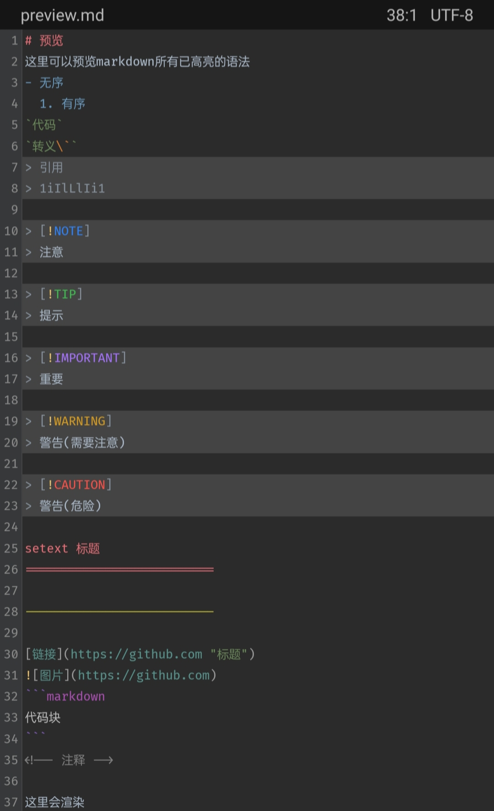

# MT Syntax HighLight
- 适用于[MT管理器](https://mt2.cn)的语法高亮配置文件(.mtsx)

[![Repo License](https://img.shields.io/github/license/guobao2333/MT-syntax-highlight?logo=data:image/svg%2bxml;base64,PHN2ZyBhcmlhLWhpZGRlbj0idHJ1ZSIgaGVpZ2h0PSIxNiIgdmlld0JveD0iMCAwIDE2IDE2IiB2ZXJzaW9uPSIxLjEiIHdpZHRoPSIxNiIgZGF0YS12aWV3LWNvbXBvbmVudD0idHJ1ZSIgY2xhc3M9Im9jdGljb24gb2N0aWNvbi1sYXcgbXItMiIgeG1sbnM9Imh0dHA6Ly93d3cudzMub3JnLzIwMDAvc3ZnIiBzdHlsZT0idXNlci1zZWxlY3Q6IGF1dG87Ij4KPHBhdGggZmlsbD0iI2Y1ZjVmNSIgZD0iTTguNzUuNzVWMmguOTg1Yy4zMDQgMCAuNjAzLjA4Ljg2Ny4yMzFsMS4yOS43MzZjLjAzOC4wMjIuMDguMDMzLjEyNC4wMzNoMi4yMzRhLjc1Ljc1IDAgMCAxIDAgMS41aC0uNDI3bDIuMTExIDQuNjkyYS43NS43NSAwIDAgMS0uMTU0LjgzOGwtLjUzLS41My41MjkuNTMxLS4wMDEuMDAyLS4wMDIuMDAyLS4wMDYuMDA2LS4wMDYuMDA1LS4wMS4wMS0uMDQ1LjA0Yy0uMjEuMTc2LS40NDEuMzI3LS42ODYuNDVDMTQuNTU2IDEwLjc4IDEzLjg4IDExIDEzIDExYTQuNDk4IDQuNDk4IDAgMCAxLTIuMDIzLS40NTQgMy41NDQgMy41NDQgMCAwIDEtLjY4Ni0uNDVsLS4wNDUtLjA0LS4wMTYtLjAxNS0uMDA2LS4wMDYtLjAwNC0uMDA0di0uMDAxYS43NS43NSAwIDAgMS0uMTU0LS44MzhMMTIuMTc4IDQuNWgtLjE2MmMtLjMwNSAwLS42MDQtLjA3OS0uODY4LS4yMzFsLTEuMjktLjczNmEuMjQ1LjI0NSAwIDAgMC0uMTI0LS4wMzNIOC43NVYxM2gyLjVhLjc1Ljc1IDAgMCAxIDAgMS41aC02LjVhLjc1Ljc1IDAgMCAxIDAtMS41aDIuNVYzLjVoLS45ODRhLjI0NS4yNDUgMCAwIDAtLjEyNC4wMzNsLTEuMjg5LjczN2MtLjI2NS4xNS0uNTY0LjIzLS44NjkuMjNoLS4xNjJsMi4xMTIgNC42OTJhLjc1Ljc1IDAgMCAxLS4xNTQuODM4bC0uNTMtLjUzLjUyOS41MzEtLjAwMS4wMDItLjAwMi4wMDItLjAwNi4wMDYtLjAxNi4wMTUtLjA0NS4wNGMtLjIxLjE3Ni0uNDQxLjMyNy0uNjg2LjQ1QzQuNTU2IDEwLjc4IDMuODggMTEgMyAxMWE0LjQ5OCA0LjQ5OCAwIDAgMS0yLjAyMy0uNDU0IDMuNTQ0IDMuNTQ0IDAgMCAxLS42ODYtLjQ1bC0uMDQ1LS4wNC0uMDE2LS4wMTUtLjAwNi0uMDA2LS4wMDQtLjAwNHYtLjAwMWEuNzUuNzUgMCAwIDEtLjE1NC0uODM4TDIuMTc4IDQuNUgxLjc1YS43NS43NSAwIDAgMSAwLTEuNWgyLjIzNGEuMjQ5LjI0OSAwIDAgMCAuMTI1LS4wMzNsMS4yODgtLjczN2MuMjY1LS4xNS41NjQtLjIzLjg2OS0uMjNoLjk4NFYuNzVhLjc1Ljc1IDAgMCAxIDEuNSAwWm0yLjk0NSA4LjQ3N2MuMjg1LjEzNS43MTguMjczIDEuMzA1LjI3M3MxLjAyLS4xMzggMS4zMDUtLjI3M0wxMyA2LjMyN1ptLTEwIDBjLjI4NS4xMzUuNzE4LjI3MyAxLjMwNS4yNzNzMS4wMi0uMTM4IDEuMzA1LS4yNzNMMyA2LjMyN1oiIHN0eWxlPSJ1c2VyLXNlbGVjdDogYXV0bzsiPjwvcGF0aD4KPC9zdmc%2B&style=flat&label=Licence)](https://github.com/guobao2333/MT-syntax-highlight/LICENSE)

### Introduce | 简介
作为一个酷爱使用手机作为生产力的苦逼程序员，偶然发现了一个名叫“MT管理器”的软件。  
起初只是当做一个，个人认为的“市面上最好用”的文件管理器和逆向工具来使用，后来发现是个写代码的好工具。

**因为它支持语法高亮！！** 同时还支持了自定义语法高亮文件。  
其核心使用了JAVA驱动的 _**正则表达式**_

----------------

所以我自己写了一些语法高亮给自己使用，同时也开源给大家用，希望大家也能够写出更多好用的mt语法高亮……
> 但是有一点不要搞错了，虽然我知道VSCode是个很好用的代码编辑器，但那只限于电脑。因为我很喜欢随时随地写代码，而在移动端我更加偏向使用MT管理器，这就是我的理由。

# Change Log | 更新日志
## 2024-5-2
### Fixed | 修复
github_markdown - [1.0.3](https://github.com/guobao2333/MT-syntax-highlight/commit/76c1f9a)
  1. 修复了上个版本导致的代码块渲染失效

> 仅展示最新文件变更版本，更多版本细节请[查看完整变更日志](CHANGELOG.md)

## Update Plan | 更新计划
- [ ] 通用markdown语法
- [ ] 优化MT原有自带语法
- [ ] 更多的语法……

# Preview | 预览

github markdown

# Usage | 使用
## List | 所有语法
- [github规范的markdown高亮](mtsx/github_markdown.mtsx)

## Install | 安装

1. 从上方下载你需要的语法配置后，在你的设备中打开`MT管理器`
2. 找到并点击以`.mtsx`为后缀的文件，然后在弹出的窗口中点击`安装`

现在您可以打开其语法支持文件，例如markdown(.md)查看效果。

# Contribute | 贡献
1. 点击上方`fork`仓库后，修改或添加你的代码
2. 点击`Pull requests`创建新的拉取请求后填写你应该填写的信息。
3. 接下来请等待代码审查，如果审查结束将会合并代码。

如果合并完成，恭喜你🎉您完成了对本项目的贡献！我们由衷的感谢为每个开源项目做出贡献的人，无论贡献多少。

# License | 许可证
[Apache-2.0 license](./LICENSE)
