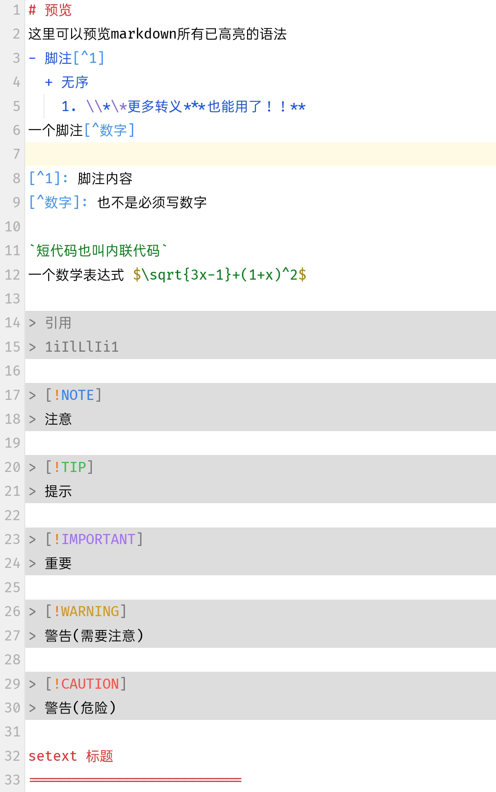
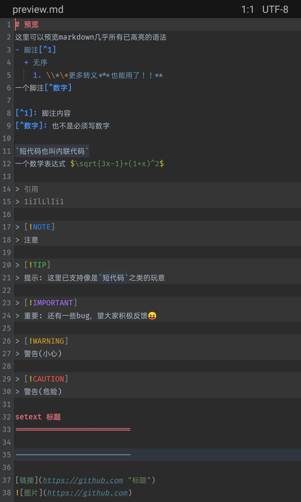

# Preview | 效果预览
> [!IMPORTANT]
> 此处预览图**可能**会过时，最新版本的效果应安装语法高亮文件后以 `preview.[相应语法后缀]` 的效果为准。
> 由于部分文件后缀会污染存储库语言，故增加 `.txt` 后缀，预览时请手动切换语法或去除此后缀。

Environment Variable

GitHub Flavored Markdown

GitIgnore

JavaScript EX(内置)

VimScript

